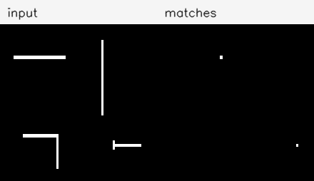
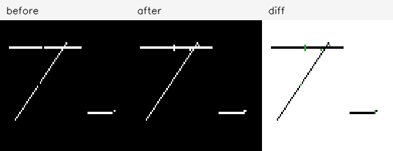
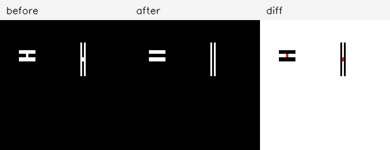
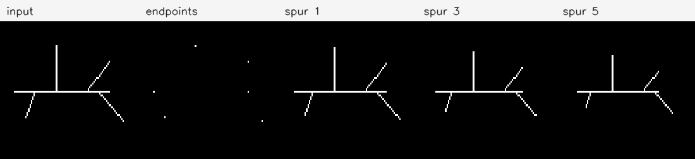

# Исторические истоки локальных морфологических операторов бинарных изображений

**Тема:** локальные бинарные морфологические операторы, основанные на hit-or-miss-преобразовании и правилах для окрестности \(3 \times 3\).  
**Практическая часть:** приложение на C++ и OpenCV для воспроизведения работы операторов `hit-or-miss`, `bridge`, `hbreak`, `endpoints`, `spur`, `clean`, `fill`, `majority`.  
**Цель:** показать историческое происхождение метода, математическую модель и воспроизвести основные демонстрационные эксперименты.

---

## Аннотация

В работе рассматриваются локальные морфологические операторы бинарной обработки изображений. Такие операторы изменяют значение пикселя не по глобальной информации об изображении, а по его малой окрестности, чаще всего по окрестности \(3 \times 3\). К ним относятся операции поиска конечных точек, удаления изолированных пикселей, заполнения малых дыр, соединения разрывов и удаления H-образных связей.

Исторически эти методы связаны с математической морфологией, возникшей как аппарат анализа геометрической структуры изображений. В отличие от линейной фильтрации, математическая морфология рассматривает бинарное изображение как множество точек, а обработку — как преобразование этого множества с помощью структурного элемента.

Основная идея работы состоит в том, чтобы показать путь от классических операций эрозии и дилатации к hit-or-miss-преобразованию, а затем к конкретным локальным операторам, реализуемым через набор шаблонов или таблицу решений для всех \(2^9 = 512\) возможных окрестностей.

---

## 1. Введение

Морфологические методы используются в задачах, где важна не столько яркость пикселя, сколько форма объекта: связность линий, наличие разрывов, мелких шумовых компонент, дыр, концов скелета или локальных перемычек. Поэтому эти методы особенно удобны для обработки бинарных изображений, скелетов, технических схем, масок сегментации, текстовых символов и простых структурных изображений.

В данной работе рассматривается не вся математическая морфология, а её небольшой, но важный фрагмент — **локальные бинарные операторы**, работающие по окрестности \(3 \times 3\). Такой выбор позволяет совместить исторический анализ, строгую математическую модель и компактную собственную реализацию.

Цель практической части — реализовать приложение, которое:

- загружает и бинаризует изображение;
- применяет выбранный локальный оператор;
- сохраняет результат до/после обработки;
- строит карту изменённых пикселей;
- позволяет проверить оператор на всех 512 возможных \(3 \times 3\) шаблонах;
- воспроизводит несколько простых исторически мотивированных экспериментов.

---

## 2. Исторический контекст

### 2.1. Возникновение математической морфологии

Математическая морфология возникла в работах Жоржа Мазерона и Жана Серра. Первоначально она развивалась как аппарат для анализа формы и пространственной структуры объектов, в частности в задачах анализа минералогических и петрографических изображений. В таких задачах важно было не просто сгладить изображение, а измерить форму, размер, распределение и взаимное расположение объектов.

Ключевая идея морфологии состоит в том, что изображение рассматривается как множество, а анализ выполняется с помощью другого множества — **структурного элемента**. Структурный элемент можно понимать как зонд, который перемещается по изображению и проверяет, помещается ли он внутри объекта, пересекает ли объект или совпадает с некоторой локальной конфигурацией.

Именно эта идея приводит к операциям эрозии, дилатации, открытия, замыкания и, позднее, к hit-or-miss-преобразованию.

### 2.2. Основные источники

В работе используются следующие источники.

**Jean Serra, _Image Analysis and Mathematical Morphology_, 1982.**  
Этот источник используется для описания общей математической модели: изображение как множество, структурный элемент, эрозия, дилатация и операции анализа формы. Основная задача, которую решала ранняя математическая морфология, — анализ геометрической структуры объектов на изображении. В современных терминах это не был датасет с train/test-разбиением, а набор микрофотографий, бинаризованных структур и демонстрационных схем.

**R. M. Haralick, S. R. Sternberg, X. Zhuang, _Image Analysis Using Mathematical Morphology_, IEEE TPAMI, 1987.**  
Эта статья важна как классический обзор морфологии в обработке изображений и машинном зрении. Авторы показывали, что морфологические операции удобны для задач, где существенны форма, связность, геометрические свойства и локальная структура объекта.

**William K. Pratt, _Digital Image Processing_.**  
Учебник Pratt используется как практический источник по цифровой обработке изображений. Для данной работы он важен как мост между теоретическими морфологическими операциями и их алгоритмической реализацией на дискретном изображении.

**D. Zhao, D. G. Daut, _Morphological Hit-or-Miss Transformation for Shape Recognition_, 1991.**  
Эта работа рассматривается как пример применения hit-or-miss-преобразования к распознаванию формы. В данной работе она используется для объяснения того, как foreground- и background-шаблоны могут задавать искомую форму.

Экспериментальная часть данной работы не копирует конкретные изображения из источников. Она использует реконструированные синтетические схемы: тонкие линии, разрывы, H-конфигурации и графоподобный скелет. Такой выбор сделан сознательно: для классических работ по морфологии часто важна не конкретная фотография, а локальная конфигурация, на которой демонстрируется действие оператора. Поэтому воспроизводятся не датасеты, а сами правила и типовые демонстрационные ситуации.

---

## 3. Математическая модель

### 3.1. Бинарное изображение как множество

Пусть изображение задано на дискретной решётке:

\[
E = \mathbb{Z}^2.
\]

Бинарное изображение можно рассматривать как функцию:

\[
I: E \rightarrow \{0,1\},
\]

где \(I(x,y)=1\) соответствует пикселю объекта, а \(I(x,y)=0\) — пикселю фона.

Тогда множество объектных пикселей задаётся как:

\[
X = \{(x,y) \in E : I(x,y)=1\}.
\]

Фон задаётся дополнением:

\[
X^c = E \setminus X.
\]

Такое представление удобно, потому что морфологические операции естественно выражаются через операции над множествами.

---

### 3.2. Структурный элемент

Структурный элемент — это небольшое множество точек:

\[
B \subset E.
\]

Его можно представить как маленькую маску, например квадрат \(3 \times 3\), крест, линию или произвольный шаблон. Сдвиг структурного элемента в точку \(p\) обозначается:

\[
B_p = \{b+p : b \in B\}.
\]

Структурный элемент играет роль локального зонда: он проверяет, как устроено изображение около текущего пикселя.

---

### 3.3. Эрозия и дилатация

Эрозия множества \(X\) структурным элементом \(B\) определяется как:

\[
X \ominus B = \{p : B_p \subseteq X\}.
\]

То есть точка \(p\) остаётся в результате, если структурный элемент, помещённый в эту точку, полностью лежит внутри объекта.

Дилатация определяется как:

\[
X \oplus B = \{p : \hat{B}_p \cap X \neq \varnothing\},
\]

где \(\hat{B}\) — отражённый структурный элемент. Дилатация расширяет объект: точка попадает в результат, если структурный элемент в этой точке пересекается с объектом.

На основе эрозии и дилатации строятся открытие и замыкание:

\[
X \circ B = (X \ominus B) \oplus B,
\]

\[
X \bullet B = (X \oplus B) \ominus B.
\]

Открытие обычно удаляет малые выступы и шумовые объекты, а замыкание заполняет малые разрывы и дыры.

---

### 3.4. Hit-or-miss-преобразование

Для локальных операторов особенно важно hit-or-miss-преобразование. Оно позволяет искать в бинарном изображении заданную конфигурацию объекта и фона.

Пусть заданы два структурных элемента:

- \(B_1\) — позиции, где должен быть объект;
- \(B_2\) — позиции, где должен быть фон.

При этом:

\[
B_1 \cap B_2 = \varnothing.
\]

Hit-or-miss-преобразование задаётся формулой:

\[
X \odot (B_1,B_2) = (X \ominus B_1) \cap (X^c \ominus B_2).
\]

Смысл этой формулы следующий:

- \(X \ominus B_1\) проверяет, что все обязательные объектные точки действительно принадлежат объекту;
- \(X^c \ominus B_2\) проверяет, что все обязательные фоновые точки действительно принадлежат фону;
- пересечение оставляет только те позиции, где одновременно выполнены оба условия.

В практической реализации это удобно записывать как шаблон \(3 \times 3\), где каждая ячейка имеет одно из трёх значений:

- `1` — здесь должен быть объект;
- `0` — здесь должен быть фон;
- `*` — значение не важно.

Например:

```text
* 1 *
0 1 0
* * *
```

Такой шаблон срабатывает, если обязательные единицы и нули совпали с локальной окрестностью изображения.

---

## 4. Локальные операторы по окрестности 3×3

### 4.1. Почему достаточно окрестности 3×3

Окрестность \(3 \times 3\) — минимальная двумерная окрестность, в которой можно анализировать не только горизонтальные и вертикальные связи, но и диагональные. Она позволяет обнаруживать:

- изолированные пиксели;
- концы линий;
- малые дыры;
- перемычки;
- диагональные разрывы;
- H-образные структуры;
- локальные ветви скелета.

В такой окрестности всего 9 пикселей, значит существует:

\[
2^9 = 512
\]

различных бинарных конфигураций. Поэтому любой локальный бинарный оператор можно представить как таблицу:

\[
LUT: \{0,1,\ldots,511\} \rightarrow \{0,1\}.
\]

Значение центрального пикселя после обработки зависит только от кода его окрестности.

---

### 4.2. Кодирование окрестности

Пусть пиксели окрестности \(3 \times 3\) пронумерованы от 0 до 8. Тогда код окрестности можно вычислить как:

\[
code = \sum_{i=0}^{8} 2^i I(p_i).
\]

После этого результат оператора можно получить как:

\[
I'(p)=LUT(code(p)).
\]

Такое представление удобно для проверки: можно перебрать все 512 вариантов и убедиться, что оператор работает именно так, как задано математическим правилом.

---

## 5. Рассматриваемые операторы

В работе реализуется минимальный набор операторов. Он достаточен, чтобы показать связь между hit-or-miss, локальными шаблонами и практической обработкой бинарных изображений.

### 5.1. `clean`

Оператор `clean` удаляет изолированные объектные пиксели.

\[
I'(p)=0,
\]

если:

\[
I(p)=1
\]

и:

\[
\sum_{q \in N_8(p) \setminus \{p\}} I(q)=0.
\]

Иначе значение пикселя не меняется.

---

### 5.2. `fill`

Оператор `fill` заполняет изолированные фоновые пиксели внутри объекта. В минимальной реализации пиксель становится единицей, если он равен нулю, а его четыре основных соседа равны единице:

\[
I(x,y)=0,
\]

\[
I(x-1,y)=I(x+1,y)=I(x,y-1)=I(x,y+1)=1.
\]

Тогда:

\[
I'(x,y)=1.
\]

---

### 5.3. `majority`

Оператор `majority` устанавливает центральный пиксель в единицу, если в окрестности \(3 \times 3\) не менее пяти единичных пикселей:

\[
I'(p)=
\begin{cases}
1, & \sum_{q \in N_8(p)} I(q) \geq 5,\\
0, & \text{иначе}.
\end{cases}
\]

Это простейший нелинейный локальный фильтр, сглаживающий бинарное изображение по правилу большинства.

---

### 5.4. `endpoints`

Оператор `endpoints` находит конечные точки скелета. Пиксель считается конечной точкой, если он принадлежит объекту и имеет ровно одного объектного соседа в 8-окрестности:

\[
I(p)=1,
\]

\[
\sum_{q \in N_8(p) \setminus \{p\}} I(q)=1.
\]

Результатом является бинарное изображение, где единицы стоят только в найденных конечных точках.

---

### 5.5. `spur`

Оператор `spur` удаляет короткие отростки скелета. В минимальной реализации одна итерация `spur` удаляет конечные точки:

\[
I'(p)=0,
\]

если \(p\) является конечной точкой.

При многократном применении оператор постепенно укорачивает ветви скелета. Поэтому для него важен параметр числа итераций.

---

### 5.6. `bridge`

Оператор `bridge` предназначен для соединения локально разорванных структур. Центральный пиксель, равный нулю, переводится в единицу, если это соединяет две ранее несвязанные части объекта.

Идея может быть записана так:

\[
I(p)=0,
\]

и после установки \(I(p)=1\) число локальных компонент объекта в окрестности уменьшается.

В терминах локальной связности:

\[
C_8(N_8(p) \cap X) > C_8((N_8(p) \cap X) \cup \{p\}),
\]

где \(C_8\) — число 8-связных компонент.

На практике оператор можно реализовать через набор 3×3 шаблонов или через LUT для всех 512 окрестностей.

---

### 5.7. `hbreak`

Оператор `hbreak` удаляет центральный пиксель в H-образной конфигурации. Его смысл противоположен `bridge`: если `bridge` восстанавливает связь, то `hbreak` разрушает некоторую локальную перемычку.

Базовый пример конфигурации:

```text
1 1 1
0 1 0
1 1 1
```

После применения центральный пиксель удаляется:

```text
1 1 1
0 0 0
1 1 1
```

Для практической реализации достаточно учесть базовую конфигурацию и её повороты/отражения. Более полное совпадение с библиотечными реализациями можно вынести в дополнительную часть.

---

## 6. Реализация приложения

Практическая часть выполняется на C++ с использованием OpenCV. OpenCV используется для чтения, записи и визуализации изображений, но сами исследуемые операторы реализуются вручную.

Общий конвейер работы приложения:

1. загрузить изображение;
2. перевести его в grayscale;
3. бинаризовать по порогу или методом Оцу;
4. применить выбранный локальный оператор;
5. сохранить результат;
6. сохранить карту изменений;
7. посчитать простые метрики.

Минимальный интерфейс командной строки:

```bash
morphlab --input input.png --operation bridge --iterations 1 --output result.png
```

Для данной работы достаточно реализовать операции:

- `hitmiss`;
- `clean`;
- `fill`;
- `majority`;
- `endpoints`;
- `spur`;
- `bridge`;
- `hbreak`.

В проект добавлены файлы:

- `src/morphlab.cpp` — реализация операторов, метрик и генератора экспериментов;
- `Makefile` — сборка приложения и запуск экспериментов;
- `results/` — сгенерированные изображения, CSV-таблицы и сводка результатов.

Сборка и запуск экспериментов:

```bash
make
make experiments
```

Параллелизация через `std::thread` не реализована, потому что цель работы — воспроизведение локальных правил, LUT-проверки и визуальных демонстраций. Для изображений экспериментального размера однопоточная реализация проще проверяется и не скрывает логику операторов.

### 6.1. Бинаризация

Входное изображение читается как grayscale. Если порог не задан, используется метод Оцу; иначе применяется ручной порог. Внутреннее представление бинарного изображения — `0` для фона и `255` для объекта:

```cpp
cv::Mat loadBinaryImage(const std::string& path, int thresholdValue) {
    cv::Mat gray = cv::imread(path, cv::IMREAD_GRAYSCALE);
    if (gray.empty()) {
        throw std::runtime_error("Cannot read image: " + path);
    }

    cv::Mat binary;
    if (thresholdValue < 0) {
        cv::threshold(gray, binary, 0, 255, cv::THRESH_BINARY | cv::THRESH_OTSU);
    } else {
        cv::threshold(gray, binary, thresholdValue, 255, cv::THRESH_BINARY);
    }
    return binary;
}
```

### 6.2. Кодирование окрестности 3×3

Выход за границы изображения трактуется как фон. Нумерация пикселей идёт построчно: верхняя левая ячейка имеет индекс 0, центральная — индекс 4, нижняя правая — индекс 8.

```cpp
uint16_t neighborhoodCode3x3(const cv::Mat& binary, int x, int y) {
    uint16_t code = 0;
    for (int i = 0; i < 9; ++i) {
        int nx = x + kOffsets[i].first;
        int ny = y + kOffsets[i].second;
        if (0 <= nx && nx < binary.cols && 0 <= ny && ny < binary.rows &&
            binary.at<uchar>(ny, nx) > 0) {
            code |= static_cast<uint16_t>(1u << i);
        }
    }
    return code;
}
```

### 6.3. LUT-оператор

Универсальная функция применения LUT создаёт новый буфер и не изменяет исходное изображение на месте:

```cpp
cv::Mat applyLutOperator(const cv::Mat& binary, const std::array<uchar, 512>& lut) {
    cv::Mat out(binary.size(), CV_8UC1, cv::Scalar(0));
    for (int y = 0; y < binary.rows; ++y) {
        for (int x = 0; x < binary.cols; ++x) {
            out.at<uchar>(y, x) = lut[neighborhoodCode3x3(binary, x, y)];
        }
    }
    return out;
}
```

### 6.4. Hit-or-miss

Шаблон задаётся массивом из девяти ячеек `Zero`, `One`, `DontCare`. Совпадение проверяется только по обязательным позициям:

```cpp
enum class Cell { Zero, One, DontCare };

struct Kernel3x3 {
    std::array<Cell, 9> cells{};
};

bool matches(const cv::Mat& binary, int x, int y, const Kernel3x3& kernel) {
    for (int i = 0; i < 9; ++i) {
        if (kernel.cells[i] == Cell::DontCare) {
            continue;
        }
        int nx = x + kOffsets[i].first;
        int ny = y + kOffsets[i].second;
        bool value = 0 <= nx && nx < binary.cols && 0 <= ny && ny < binary.rows &&
                     binary.at<uchar>(ny, nx) > 0;
        if ((kernel.cells[i] == Cell::One) != value) {
            return false;
        }
    }
    return true;
}
```

### 6.5. Построение LUT

Операторы `clean`, `fill`, `majority`, `endpoints`, `spur`, `bridge`, `hbreak` реализованы как функции построения таблиц длиной 512. Например, `majority` задаётся непосредственно через число единиц в коде окрестности:

```cpp
std::array<uchar, 512> buildMajorityLut() {
    std::array<uchar, 512> lut{};
    for (uint16_t code = 0; code < 512; ++code) {
        lut[code] = foregroundCount(code) >= 5 ? 255 : 0;
    }
    return lut;
}
```

Для `bridge` используется локальная 8-связность. Если центральный пиксель равен нулю, проверяется, уменьшится ли число компонент в окрестности после его добавления:

```cpp
std::array<uchar, 512> buildBridgeLut() {
    std::array<uchar, 512> lut{};
    for (uint16_t code = 0; code < 512; ++code) {
        if (bit(code, kCenter)) {
            lut[code] = 255;
            continue;
        }
        int before = localComponents8(code, false);
        int after = localComponents8(static_cast<uint16_t>(code | (1u << kCenter)), true);
        lut[code] = before >= 2 && after < before ? 255 : 0;
    }
    return lut;
}
```

Полная реализация находится в `src/morphlab.cpp`.

---

## 7. Экспериментальная часть

Эксперименты нужны не только для демонстрации работы программы, но и для проверки математического понимания операторов. Поскольку для старых источников часто нет современного опубликованного датасета, используются два типа данных:

1. **синтетические изображения**, где результат можно проверить вручную;
2. **реконструированные изображения**, построенные по схемам или рисункам из источников.

---

### 7.1. Эксперимент 1. Проверка hit-or-miss-преобразования

**Цель:** показать, что hit-or-miss находит только те позиции, где одновременно совпадают объектные и фоновые части шаблона.

**Входные данные:** синтетическое бинарное изображение с несколькими простыми фигурами: линиями, углами, крестами или буквоподобными фрагментами.

**Шаблон:** один или несколько шаблонов \(3 \times 3\), например шаблон конца линии или угла.

**Ход эксперимента:**

1. Создать бинарное изображение.
2. Задать hit-or-miss-шаблон.
3. Применить оператор.
4. Отметить найденные центры совпадений.
5. Сравнить результат с ручной разметкой.

**Ожидаемый результат:** оператор должен находить только те места, где совпадают все обязательные `1` и `0`, игнорируя позиции `*`.

**Результат:** использован шаблон правого конца горизонтальной линии:

```text
0 0 0
1 1 0
0 0 0
```

На синтетическом изображении найдено 2 совпадения. Они соответствуют двум правым концам горизонтальных фрагментов; вертикальная линия, угол и локально изменённый фрагмент не были отмечены, потому что обязательные фоновые и объектные позиции не совпали с шаблоном.



---

### 7.2. Эксперимент 2. Полный перебор 512 окрестностей

**Цель:** проверить, что локальные операторы корректно определены для всех возможных \(3 \times 3\) конфигураций.

**Входные данные:** все \(2^9 = 512\) бинарных окрестностей.

**Ход эксперимента:**

1. Сгенерировать все числа от 0 до 511.
2. Для каждого числа построить соответствующую матрицу \(3 \times 3\).
3. Применить к ней выбранный оператор.
4. Сохранить значение центрального пикселя после обработки.
5. Сформировать CSV-таблицу: `code`, `input_pattern`, `output_center`.

**Ожидаемый результат:** для каждого оператора получается таблица истинности, полностью задающая его локальное поведение.

**Результат:** для операторов сгенерированы CSV-таблицы:

- `results/exp2_lut_clean.csv`;
- `results/exp2_lut_bridge.csv`;
- `results/exp2_lut_hbreak.csv`;
- `results/exp2_lut_summary.csv`.

Сводка полного перебора:

| Оператор | Изменяемых конфигураций | Единиц в LUT |
|---|---:|---:|
| `clean` | 1 | 255 |
| `fill` | 16 | 272 |
| `majority` | 186 | 256 |
| `endpoints` | 248 | 8 |
| `spur` | 8 | 248 |
| `bridge` | 123 | 379 |
| `hbreak` | 2 | 254 |

Интерпретация таблицы: `clean` изменяет только одну конфигурацию — полностью изолированную центральную единицу; `endpoints` не является сохраняющим оператором, поэтому оставляет единицы только в 8 конфигурациях с ровно одним соседом; `bridge` добавляет центральный пиксель в 123 конфигурациях, где это уменьшает число локальных 8-связных компонент.

---

### 7.3. Эксперимент 3. Оператор `bridge`

**Цель:** показать восстановление локальной связности в изображении.

**Входные данные:** синтетические изображения с разрывами тонких линий и диагональными разрывами.

**Ход эксперимента:**

1. Создать несколько изображений с разорванными линиями.
2. Применить `bridge`.
3. Построить diff-карту добавленных пикселей.
4. Посчитать число компонент до и после обработки.

**Метрика:** число 8-связных компонент до и после:

\[
C_8(I_{before}), \quad C_8(I_{after}).
\]

**Ожидаемый результат:** после применения `bridge` число локальных или глобальных компонент должно уменьшиться либо остаться тем же, а добавленные пиксели должны находиться только в местах локальных разрывов.

**Результат:** на синтетической сцене с горизонтальным, диагональным и малым локальным разрывом оператор добавил 8 пикселей. Число глобальных 8-связных компонент уменьшилось с 5 до 2.

| Компонент до | Компонент после | Добавлено пикселей | Изменено пикселей |
|---:|---:|---:|---:|
| 5 | 2 | 8 | 8 |

На diff-карте зелёным показаны добавленные пиксели, чёрным — пиксели, которые остались объектом.



---

### 7.4. Эксперимент 4. Оператор `hbreak`

**Цель:** показать удаление H-образной локальной связи.

**Входные данные:** несколько H-образных бинарных конфигураций, включая повороты и отражения базового шаблона.

**Ход эксперимента:**

1. Создать базовую H-конфигурацию.
2. Создать её повороты и отражения.
3. Применить `hbreak`.
4. Проверить, что удаляются только пиксели, соответствующие H-связи.

**Ожидаемый результат:** центральный пиксель H-конфигурации удаляется, а остальные пиксели не изменяются.

**Результат:** оператор удалил 2 пикселя: центральный пиксель горизонтальной H-конфигурации и центральный пиксель её повёрнутой вертикальной версии. Остальные пиксели не изменились.



---

### 7.5. Эксперимент 5. `endpoints` и `spur`

**Цель:** показать поиск конечных точек скелета и удаление коротких отростков.

**Входные данные:** синтетический скелет: линии, буквы или простая графовая структура с несколькими ветвями.

**Ход эксперимента:**

1. Подать на вход бинарный скелет.
2. Применить `endpoints` и получить карту конечных точек.
3. Применить `spur` на 1, 3 и 5 итераций.
4. Сравнить, как меняется число объектных пикселей и число конечных точек.

**Метрики:**

\[
|X_{before}|, \quad |X_{after}|,
\]

\[
N_{endpoints}^{before}, \quad N_{endpoints}^{after}.
\]

**Ожидаемый результат:** `endpoints` должен выделять концы ветвей, а `spur` — постепенно удалять короткие отростки. При слишком большом числе итераций оператор может начать удалять полезные части скелета, что является ограничением метода.

**Результат:** на графоподобном синтетическом скелете найдено 6 конечных точек. Повторное применение `spur` укорачивает ветви: число объектных пикселей уменьшается, но число конечных точек остаётся равным 6, потому что топология дерева на первых итерациях сохраняется.

| Вариант | Пикселей объекта | Конечных точек | Компонент 8-связности |
|---|---:|---:|---:|
| input | 139 | 6 | 1 |
| spur 1 | 133 | 6 | 1 |
| spur 3 | 121 | 6 | 1 |
| spur 5 | 109 | 6 | 1 |



---

## 8. Метрики и оценка результатов

Для анализа экспериментов достаточно использовать простые метрики.

Число объектных пикселей:

\[
|X| = \sum_{p \in \Omega} I(p).
\]

Число изменённых пикселей:

\[
D = |\{p : I_{before}(p) \neq I_{after}(p)\}|.
\]

Расстояние Хэмминга между двумя бинарными изображениями:

\[
H(I_1,I_2)=\sum_{p \in \Omega} |I_1(p)-I_2(p)|.
\]

Число связных компонент можно считать для 4-связности и 8-связности. В минимальной версии достаточно 8-связности, так как большинство рассматриваемых локальных операторов анализируют именно 8-окрестность.

В приложении метрики реализованы в `src/morphlab.cpp`. Число объектных пикселей считается через `cv::countNonZero`, число изменённых пикселей — через сравнение двух бинарных изображений, а число компонент — через `cv::connectedComponents` с 8-связностью:

```cpp
static int countComponents8(const cv::Mat& binary) {
    cv::Mat labels;
    int labelsCount = cv::connectedComponents(binary, labels, 8, CV_32S);
    return std::max(0, labelsCount - 1);
}

static int countChanged(const cv::Mat& before, const cv::Mat& after) {
    cv::Mat diff;
    cv::compare(before, after, diff, cv::CMP_NE);
    return cv::countNonZero(diff);
}
```

Кроме того, для diff-карт отдельно считаются добавленные и удалённые пиксели. Это удобно для операторов разных типов: `bridge` должен в основном добавлять пиксели, а `clean`, `spur`, `hbreak` — удалять.

---

## 9. Обсуждение ограничений

Рассматриваемые операторы являются локальными: они принимают решение только по окрестности \(3 \times 3\). Это делает их простыми, быстрыми и полностью проверяемыми, но одновременно ограничивает их возможности.

Основные ограничения:

1. Локальный оператор не видит глобальную форму объекта.
2. Один и тот же шаблон может быть полезным в одной задаче и вредным в другой.
3. Операторы типа `spur` зависят от числа итераций.
4. `bridge` может соединить структуры, которые визуально кажутся разными объектами, если локальное правило разрешает соединение.
5. Для исторических источников не всегда доступны оригинальные изображения, поэтому часть экспериментов приходится реконструировать.

Тем не менее именно локальность делает эти операторы удобными для изучения: их можно полностью описать через конечный набор правил и проверить на всех 512 возможных конфигурациях.

---

## 10. Заключение

В работе были рассмотрены исторические и математические основания локальных морфологических операторов бинарных изображений. Было показано, что такие операции естественно возникают из общей идеи математической морфологии: изображение рассматривается как множество, а обработка выполняется с помощью структурного элемента.

Hit-or-miss-преобразование занимает центральное место, так как позволяет формально описывать поиск заданной локальной конфигурации объекта и фона. На его основе или в близкой к нему логике задаются локальные операторы `endpoints`, `spur`, `bridge`, `hbreak`, `clean`, `fill` и `majority`.

Практическая часть работы состоит в реализации приложения на C++ и OpenCV, которое применяет эти операторы к бинарным изображениям, проверяет их на всех 512 возможных \(3 \times 3\) окрестностях и воспроизводит несколько простых демонстрационных экспериментов.

Главный результат работы показывает, что локальные морфологические операторы — это не набор произвольных библиотечных функций, а компактная и математически объяснимая система правил для анализа формы, связности и локальной структуры бинарного изображения.

Выполненные эксперименты подтвердили ожидаемое поведение операторов. `hit-or-miss` нашёл только позиции, полностью совпадающие с заданным foreground/background-шаблоном. Полный перебор 512 окрестностей дал конечные таблицы истинности для всех реализованных операторов. `clean` изменяет единственную конфигурацию изолированной центральной единицы, `endpoints` оставляет только 8 конфигураций конечных точек, а `majority` действует как симметричный локальный фильтр по правилу не менее пяти единиц.

На реконструированных сценах `bridge` уменьшил число 8-связных компонент с 5 до 2, добавив 8 пикселей в местах локальных разрывов. `hbreak` удалил только центральные пиксели двух H-конфигураций. `spur` при 1, 3 и 5 итерациях последовательно уменьшал длину ветвей скелета: число объектных пикселей изменилось с 139 до 133, 121 и 109 соответственно. Эти результаты также показывают ограничение локального подхода: полезность операции зависит от выбранного правила и числа итераций, а не от глобального понимания объекта.

---

## Список литературы

1. Serra J. _Image Analysis and Mathematical Morphology_. Academic Press, 1982.
2. Haralick R. M., Sternberg S. R., Zhuang X. _Image Analysis Using Mathematical Morphology_. IEEE Transactions on Pattern Analysis and Machine Intelligence, 1987.
3. Pratt W. K. _Digital Image Processing_. John Wiley & Sons.
4. Gonzalez R. C., Woods R. E. _Digital Image Processing_. Prentice Hall.
5. Zhao D., Daut D. G. _Morphological Hit-or-Miss Transformation for Shape Recognition_. Journal of Visual Communication and Image Representation, 1991.
6. MATLAB Documentation. `bwmorph` — Morphological operations on binary images.
