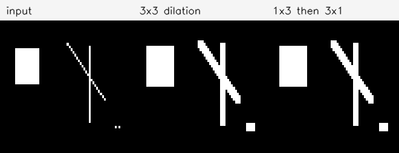

# Воспроизведение экспериментов локальной математической морфологии

**Тема:** hit-or-miss-преобразование и локальные бинарные операторы для окрестности \(3 \times 3\).

**Практический результат:** написана программа на C++17 и OpenCV, которая воспроизводит основные демонстрационные эксперименты: разложение дилатации, hit-or-miss-распознавание локальной формы, полный перебор всех \(2^9=512\) окрестностей, `bridge`, `hbreak`, `endpoints` и `spur`.

**Ключевое отличие от обзорного текста:** работа не ограничивается описанием статей. Для каждого оператора задан протокол, входное изображение или полный набор локальных конфигураций, ожидаемый результат, численные метрики и сгенерированные артефакты в каталоге `results/`.

---

## 1. Что именно воспроизводится

Классические работы по математической морфологии обычно не содержат современных датасетов, train/test-разбиений и таблиц accuracy. Их экспериментальная часть устроена иначе: авторы берут контролируемую геометрическую конфигурацию и показывают, что оператор сохраняет, удаляет, соединяет или обнаруживает нужное свойство формы.

Поэтому в этой работе воспроизводятся не фотографии из статей, а проверяемые операторные демонстрации:

| Источник | Что взято из источника | Как воспроизведено в программе |
|---|---|---|
| Serra, 1982 | Представление бинарного изображения как множества и структурный элемент как геометрический зонд | Все операции формализованы как преобразования локального множества пикселей |
| Haralick, Sternberg, Zhuang, 1987 | Дилатация, разложение структурного элемента, морфология как алгебра формы | Эксперимент 0 проверяет, что дилатация квадратом \(3 \times 3\) совпадает с последовательной дилатацией элементами \(1 \times 3\) и \(3 \times 1\) |
| Zhao, Daut, 1991 | Hit-or-miss как одновременная проверка объекта и фона | Эксперимент 1 ищет правый конец линии foreground/background-шаблоном |
| MathWorks `bwmorph` | Имена и смысл локальных операций `clean`, `fill`, `majority`, `endpoints`, `spur`, `bridge`, `hbreak` | Эксперимент 2 строит LUT для всех 512 окрестностей; эксперименты 3-5 проверяют поведение на синтетических сценах |

---

## 2. Запуск воспроизведения

Сборка:

```bash
make
```

Запуск всех экспериментов:

```bash
make experiments
```

Команда создаёт в `results/` изображения, CSV-таблицы и файл `results/experiment_summary.md`. Это важно: результаты не нарисованы вручную, а каждый раз генерируются из кода `src/morphlab.cpp`.

Программа также работает с пользовательским изображением:

```bash
build/morphlab --input input.png --operation bridge --iterations 1 --output result.png --diff diff.png
```

После обработки печатаются метрики:

```text
pixels_before=... pixels_after=... components8_before=... components8_after=... changed=... added=... removed=...
```

---

## 3. Математическая модель

Бинарное изображение рассматривается как множество объектных пикселей:

\[
X=\{(x,y): I(x,y)=1\}, \qquad I: \mathbb{Z}^2 \to \{0,1\}.
\]

Эрозия структурным элементом \(B\):

\[
X \ominus B = \{p : B_p \subseteq X\}.
\]

Дилатация:

\[
X \oplus B = \{p : \hat{B}_p \cap X \neq \varnothing\}.
\]

Hit-or-miss использует две непересекающиеся части шаблона: обязательный объект \(B_1\) и обязательный фон \(B_2\):

\[
H(X;B_1,B_2)=(X\ominus B_1)\cap(X^c\ominus B_2), \qquad B_1\cap B_2=\varnothing.
\]

Практически это удобно задавать шаблоном \(3 \times 3\), где:

- `1` означает обязательный объектный пиксель;
- `0` означает обязательный фоновый пиксель;
- `*` означает don't-care.

Для локальных операторов окрестность кодируется числом:

\[
code=\sum_{i=0}^{8}2^i I(p_i).
\]

Так как возможных кодов всего \(2^9=512\), любой оператор \(3 \times 3\) можно полностью проверить таблицей:

\[
LUT:\{0,\ldots,511\}\to\{0,1\}.
\]

---

## 4. Реализация

В проекте реализованы:

- `hitmiss` - прямой foreground/background-шаблон;
- `clean` - удаление изолированной центральной единицы;
- `fill` - заполнение изолированного нуля по четырём ортогональным соседям;
- `majority` - единица, если в окрестности не меньше пяти единиц;
- `endpoints` - поиск пикселей скелета с ровно одним 8-соседом;
- `spur` - итеративное удаление конечных точек;
- `bridge` - добавление центрального нуля, если это уменьшает число локальных 8-связных компонент;
- `hbreak` - удаление центральной H-перемычки в горизонтальной или вертикальной ориентации.

OpenCV используется для чтения, записи, бинаризации, визуализации и подсчёта компонент. Сами локальные правила реализованы вручную.

---

## 5. Эксперимент 0. Разложение дилатации

**Связь с Haralick--Sternberg--Zhuang.** В статье подчёркивается, что крупный морфологический эффект можно получить композицией малых структурных элементов. Это не просто оптимизация: она показывает алгебраическую природу морфологии.

**Цель:** проверить, что дилатация квадратом \(3 \times 3\) эквивалентна последовательности:

\[
X \oplus (1 \times 3) \oplus (3 \times 1).
\]

**Протокол:**

1. Создаётся синтетическое бинарное изображение с прямоугольником, линиями и отдельными точками.
2. Выполняется прямая дилатация квадратным элементом \(3 \times 3\).
3. Выполняется последовательная дилатация горизонтальным элементом \(1 \times 3\), затем вертикальным \(3 \times 1\).
4. Считается число отличающихся пикселей между двумя результатами.

**Полученный результат:**

| Пикселей до | Пикселей после 3x3 | Пикселей после разложения | Отличий |
|---:|---:|---:|---:|
| 219 | 424 | 424 | 0 |

Отличий нет, значит экспериментально подтверждена эквивалентность двух способов построения дилатации на выбранной дискретной сцене.



---

## 6. Эксперимент 1. Hit-or-miss

**Связь с Zhao--Daut.** Воспроизводится принцип распознавания формы через одновременную проверку нужных объектных пикселей и запрещённых фоновых пикселей.

**Шаблон правого конца горизонтальной линии:**

```text
0 0 0
1 1 0
0 0 0
```

**Цель:** показать, что оператор не просто ищет две соседние единицы, а требует также отсутствия объекта в запрещённых позициях.

**Протокол:**

1. Создаётся изображение с горизонтальными линиями, вертикальной линией, углом и локально искажённым фрагментом.
2. Применяется hit-or-miss-шаблон.
3. Считается число найденных центров совпадений.

**Полученный результат:** найдено 2 совпадения. Они соответствуют правым концам горизонтальных фрагментов. Вертикальная линия, угол и искажённый фрагмент не отмечены, потому что не удовлетворяют foreground/background-условию.


---

## 7. Эксперимент 2. Полная проверка всех 512 окрестностей

**Цель:** не доверять визуальным примерам, а полностью проверить локальное поведение каждого оператора.

**Протокол:**

1. Перебираются все коды от 0 до 511.
2. Каждый код интерпретируется как матрица \(3 \times 3\).
3. Для каждого оператора вычисляется выходной центральный пиксель.
4. Результат записывается в CSV.
5. Отдельно считается, сколько конфигураций оператор меняет, сколько добавляет и сколько удаляет.

**Полученная сводка:**

| Оператор | Изменяемых конфигураций | Добавляет | Удаляет | Единиц в LUT |
|---|---:|---:|---:|---:|
| `clean` | 1 | 0 | 1 | 255 |
| `fill` | 16 | 16 | 0 | 272 |
| `majority` | 186 | 93 | 93 | 256 |
| `endpoints` | 248 | 0 | 248 | 8 |
| `spur` | 8 | 0 | 8 | 248 |
| `bridge` | 123 | 123 | 0 | 379 |
| `hbreak` | 2 | 0 | 2 | 254 |

**Интерпретация:**

- `clean` меняет ровно одну конфигурацию: изолированную центральную единицу.
- `fill` добавляет 16 конфигураций, где нулевой центр окружён четырьмя ортогональными единицами, а диагонали произвольны.
- `majority` симметричен: 93 конфигурации добавляет и 93 удаляет.
- `endpoints` не является фильтром сохранения формы: он оставляет только 8 конфигураций конечных точек.
- `bridge` только добавляет пиксели и делает это в 123 локальных конфигурациях, где добавление центра уменьшает число 8-связных компонент.
- `hbreak` только удаляет два центральных пикселя: горизонтальную и вертикальную H-конфигурации.

CSV-файлы:

- `results/exp2_lut_clean.csv`;
- `results/exp2_lut_fill.csv`;
- `results/exp2_lut_majority.csv`;
- `results/exp2_lut_endpoints.csv`;
- `results/exp2_lut_spur.csv`;
- `results/exp2_lut_bridge.csv`;
- `results/exp2_lut_hbreak.csv`;
- `results/exp2_lut_summary.csv`.

Этот эксперимент сильнее простой картинки: он исчерпывает всё пространство входов локального оператора.

---

## 8. Эксперимент 3. `bridge`

**Цель:** проверить восстановление локальной связности.

**Правило:** центральный пиксель, равный нулю, переводится в единицу, если после этого число локальных 8-связных компонент уменьшается:

\[
C_8(N_8(p)\cap X) > C_8((N_8(p)\cap X)\cup\{p\}).
\]

**Протокол:**

1. Создаётся сцена с горизонтальным разрывом, диагональным разрывом и коротким локальным разрывом.
2. Применяется `bridge`.
3. Строится diff-карта: зелёный - добавленные пиксели, чёрный - неизменённый объект.
4. Считаются глобальные 8-связные компоненты до и после.

**Полученный результат:**

| Компонент до | Компонент после | Добавлено пикселей | Изменено пикселей |
|---:|---:|---:|---:|
| 5 | 2 | 8 | 8 |

Оператор добавил только пиксели и уменьшил число компонент с 5 до 2. Это соответствует ожидаемому смыслу `bridge`: восстановить локально разорванные линии.


---

## 9. Эксперимент 4. `hbreak`

**Цель:** проверить удаление H-образной перемычки.

**Базовый шаблон:**

```text
1 1 1
0 1 0
1 1 1
```

После операции центральная единица удаляется:

```text
1 1 1
0 0 0
1 1 1
```

**Протокол:**

1. Создаются горизонтальная и вертикальная H-конфигурации.
2. Применяется `hbreak`.
3. Проверяется, что изменились только центральные пиксели H-связей.

**Полученный результат:** удалено 2 пикселя. Сработали горизонтальная и вертикальная версии H-шаблона.


---

## 10. Эксперимент 5. `endpoints` и `spur`

**Цель:** проверить поиск конечных точек скелета и итеративное удаление коротких ветвей.

Пиксель является конечной точкой, если:

\[
I(p)=1,\qquad \sum_{q\in N_8(p)\setminus\{p\}} I(q)=1.
\]

Одна итерация `spur` удаляет такие конечные точки. Несколько итераций постепенно укорачивают ветви.

**Протокол:**

1. Создаётся графоподобный скелет из тонких линий.
2. Применяется `endpoints`.
3. Применяется `spur` на 1, 3 и 5 итераций.
4. Считаются пиксели объекта, конечные точки и 8-связные компоненты.

**Полученный результат:**

| Вариант | Пикселей объекта | Конечных точек | Компонент 8-связности |
|---|---:|---:|---:|
| input | 139 | 6 | 1 |
| spur 1 | 133 | 6 | 1 |
| spur 3 | 121 | 6 | 1 |
| spur 5 | 109 | 6 | 1 |

После каждой итерации ветви укорачиваются. Связность дерева на этих шагах сохраняется: компонент остаётся 1. Это также показывает ограничение метода: при слишком большом числе итераций `spur` будет продолжать укорачивать не только шумовые, но и полезные ветви.


---

## 11. Что стало лучше по сравнению с простым обзором

В исходной обзорной постановке можно было сказать, что Haralick “показывает дилатацию”, Zhao--Daut “используют hit-or-miss”, а `bwmorph` “содержит локальные операции”. Этого недостаточно для экспериментальной работы.

В текущей версии сделано другое:

1. Для каждого оператора задано формальное локальное правило.
2. Для каждого правила написан исполняемый код.
3. Для `3 \times 3`-операторов выполнена полная проверка всех 512 входов.
4. Для визуальных операций сгенерированы синтетические сцены с известным ожидаемым результатом.
5. Для каждого эксперимента сохранены изображения и численные метрики.
6. Результаты можно воспроизвести одной командой `make experiments`.

Таким образом, работа стала не пересказом источников, а маленькой воспроизводимой лабораторией локальной математической морфологии.

---

## 12. Ограничения

Ограничения нужно указать явно, потому что они важны для корректной атрибуции.

1. Сцены являются реконструированными синтетическими примерами, а не оригинальными изображениями из статей.
2. Операции `bridge`, `hbreak`, `spur` реализованы как собственные локальные правила, совместимые по смыслу с `bwmorph`, но не заявлены как побитовая копия MATLAB.
3. `fill` использует правило четырёх ортогональных соседей; это понятный локальный вариант, но его нужно отличать от более строгих библиотечных определений.
4. Метрики простые: число пикселей, число изменённых пикселей, добавления, удаления и 8-связные компоненты. Для данной задачи этого достаточно, потому что проверяется не классификация на датасете, а геометрическое действие оператора.

---

## 13. Вывод

Классическая математическая морфология ценна не только исторически. Её сильная сторона в том, что оператор можно задать как точное геометрическое правило и полностью проверить на конечном множестве локальных конфигураций.

В работе воспроизведены основные демонстрационные идеи: композиция структурных элементов, hit-or-miss-поиск формы с явным фоном, локальные LUT-операторы, восстановление и разрушение связности, поиск и удаление концов скелета. Практическая программа подтверждает эти свойства численно: разложение дилатации дало 0 отличий, hit-or-miss нашёл 2 корректных совпадения, `bridge` уменьшил число компонент с 5 до 2, `hbreak` удалил 2 H-перемычки, а `spur` последовательно уменьшил скелет со 139 до 109 пикселей за 5 итераций.

Главный результат: локальные морфологические операторы являются не набором “эффектов” из библиотеки, а проверяемой системой правил для анализа формы. Именно это делает их полезными для интерпретируемой обработки бинарных изображений, технических схем, скелетов и постобработки масок сегментации.

---

## Список литературы

1. J. Serra. *Image Analysis and Mathematical Morphology*. Academic Press, 1982.
2. R. M. Haralick, S. R. Sternberg, X. Zhuang. Image Analysis Using Mathematical Morphology. *IEEE Transactions on Pattern Analysis and Machine Intelligence*, PAMI-9(4):532-550, 1987. DOI: 10.1109/TPAMI.1987.4767941.
3. D. Zhao, D. G. Daut. Morphological Hit-or-Miss Transformation for Shape Recognition. *Journal of Visual Communication and Image Representation*, 2(3):230-243, 1991.
4. MathWorks. `bwmorph`: Morphological operations on binary images. Documentation.
